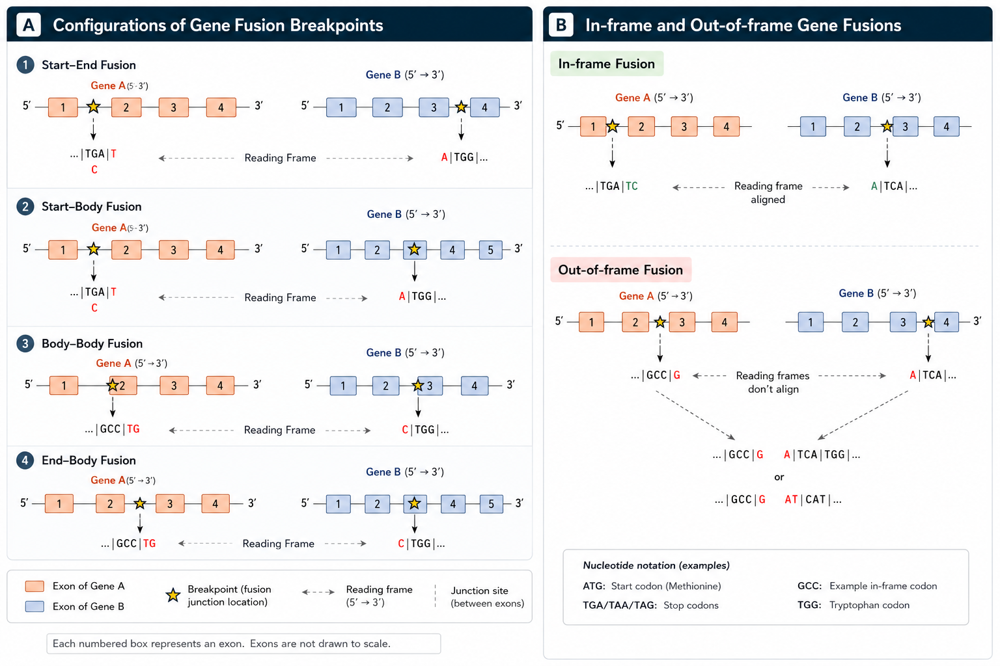

# Description

## Purpose

PyFuse annotates gene fusion breakpoints by combining genomic breakpoint coordinates with transcript and exon context. The output is designed for downstream triage of fusion candidates in translational and clinical bioinformatics workflows.

## What PyFuse computes

For each fusion event, PyFuse derives:

- 5-prime and 3-prime partner gene pairing
- breakpoint positional context (for example exon boundary vs exon body)
- exon-level annotations for both partners
- coding frame relationship across the fusion junction
- optional fusion nucleotide sequence context when reference FASTA is provided

## Biological interpretation model

PyFuse follows a transcript-aware interpretation model where one breakpoint is mapped to the 5-prime partner and the other to the 3-prime partner, then interpreted at exon resolution.

Common breakpoint configurations include:

- Start-End fusion
- Start-Body fusion
- Body-Body fusion
- End-Body fusion



*Figure 1. Breakpoint configuration patterns and frame interpretation.*

These configurations help explain whether transcript structures are plausibly compatible with a functional fusion transcript.

## Frame status interpretation

Frame status indicates whether coding continuity is preserved across the junction:

- In-frame: codon phase continuity is maintained through the fusion point
- Out-of-frame: coding continuity is disrupted, often implying altered downstream protein sequence

Important note: frame interpretation can be transcript-dependent. Multiple transcript combinations for the same breakpoint pair may yield different frame outcomes.

## Output intent

PyFuse outputs are optimized for both machine processing and analyst review:

- tabular outputs (Excel/summary) for review and filtering
- VCF output for pipeline interoperability
- interactive HTML for case exploration 
    The table has search, sort and filtering functionalities
    The genes are hyperlinked to GeneCards and co-ordinates/transcripts are hyperlinked to UCSC genome browser

*Figure 2. Example interactive HTML output generated by PyFuse.*

## Citation

If PyFuse contributes to your analysis or manuscript, please cite it.

Placeholder citation text:

```text
PyFuse (Python Fusion Annotator), version X.Y.Z.
GitHub: https://github.com/gopisiva1616/PyFuse.git
```

Machine-readable citation metadata is available in `CITATION.cff`.


